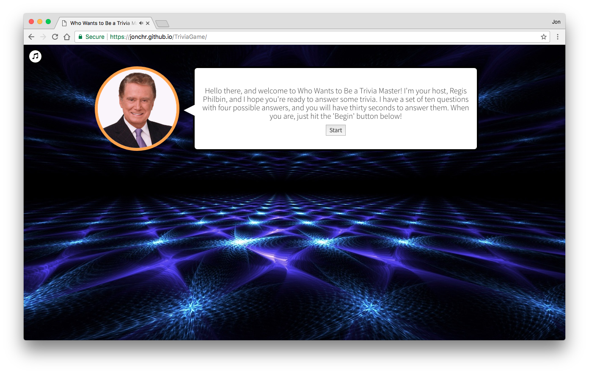
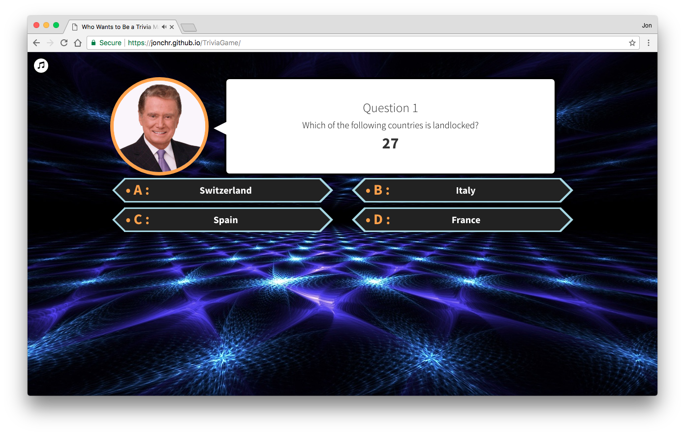
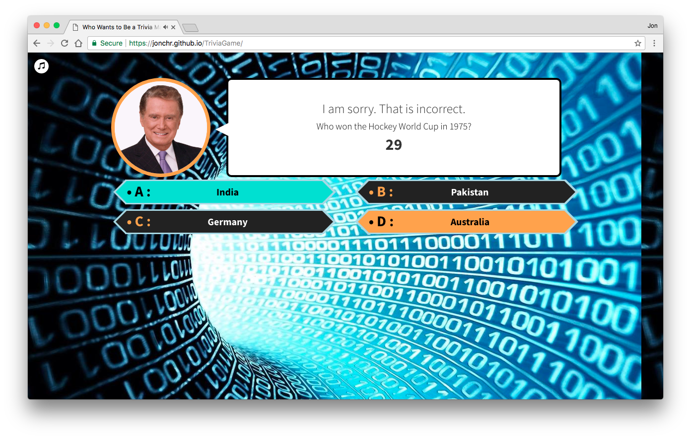
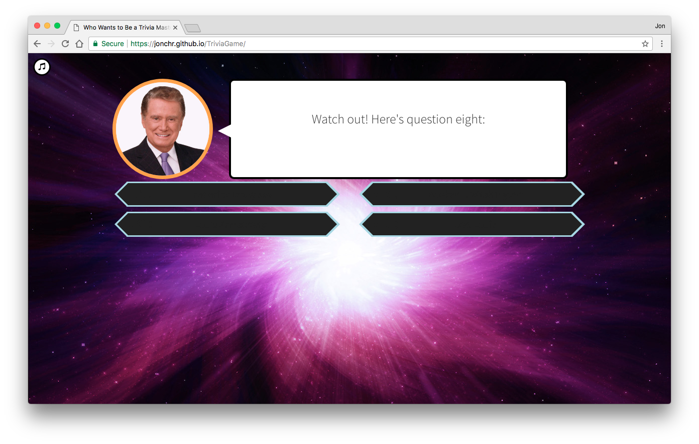
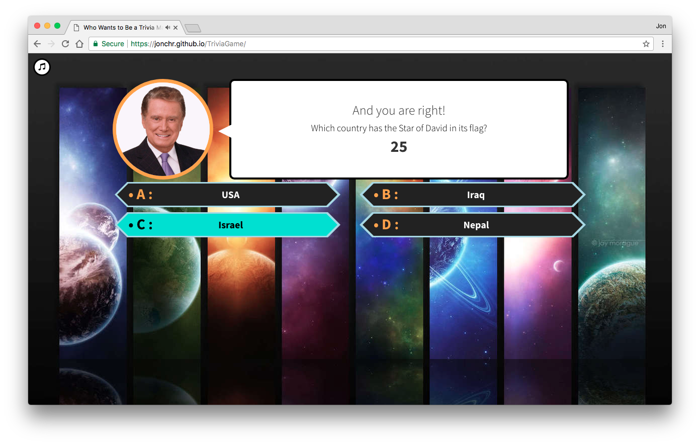
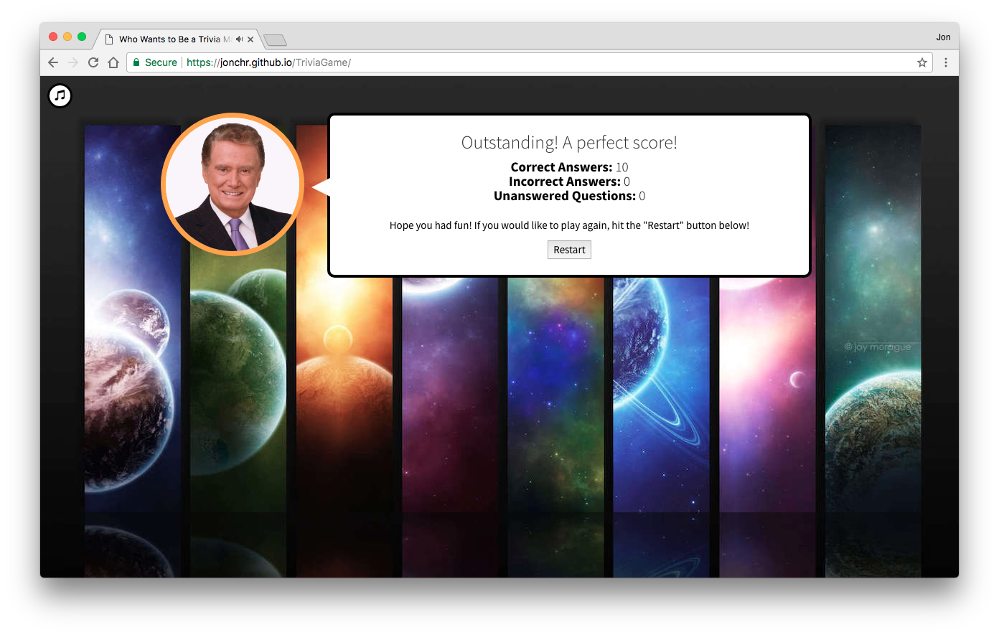

# TriviaGame
A 90's game show themed Trivia Game demonstrating Javascript logic and jQuery. This app creates a static webpage containing the game. A live version can be found at: https://jonchr.github.io/Trivia-Game/

## Description

This site is an online Trivia game based on Who Wants to be a Millionaire. The player is asked to complete ten rounds of questions by selecting one of four provided answers. Answers can be selected either by selecting them or by pressing the associated letter (A-D). The correct answer is shown, and then after a brief intermission the next question is revealed. The player is shown their overall score at the end. The player can then choose to start a new game with new questions.

Each of the ten questions is randomly pulled from a pool of 30+ questions at the beginning of each game. The backgrounds and music change with each of the four phases of the game for questions 1-3, 4-6, 7-9, and 10.

All theme music and sound effects can be disabled or enabled by pressing the music icon at the top left corner. A perfect game will give the player a different ending message with special ending music.

### Development

This game was developed as part of the GW Coding Bootcamp and was built during the third week. Final touches such as the hexagonal shapes and phase changes were added later on. This project was built using HTML5, CSS3 with Bootstrap 3.3.7, Javascript, and jQuery. This project made heavy use of setInterval/Timeouts and onClick functions.

The Bootstrap version used was Cosmo Bootswatch from https://bootswatch.com/cosmo/

All images were found using Google Image search.

All music was downloaded from https://www.mezgrman.de/wwm-sounds

### Organization

To run the game locally on your own computer, you can run the following in command line:

		git clone https://github.com/jonchr/TriviaGame.git
		cd TriviaGame
		open index.html

Upon cloning to your local machine, you can change the layout by editing index.html, the formatting in assets/css/style.css, or the functionality in assets/javascript/game.js.

## Screenshots
### Welcome Screen

### Question One, Phase One

### An Incorrect Answer in Phase Two

### Intermission in Phase Three

### A Correct Answer in Phase Four

### Perfect Results

